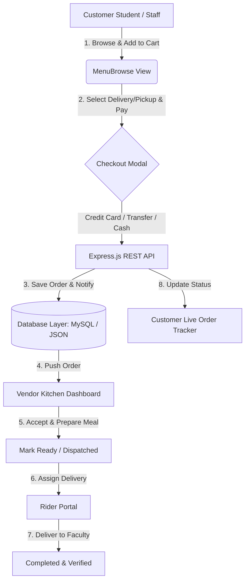

# FUOTUOKE Campus Eats — Campus Food Ordering & Delivery Ecosystem


**FUOTUOKE Campus Eats** is an enterprise-grade, full-stack digital dining platform and campus food delivery system engineered specifically for the **Federal University Otuoke (FUOTUOKE)** community in Bayelsa State, Nigeria.

The system unifies campus dining operations into a single cohesive platform connecting **Students, University Staff, Cafeteria Kitchen Staff, Delivery Riders, and System Administrators**. It eliminates long cafeteria queue times, streamlines faculty deliveries, automates order dispatching, and supports multi-channel payment reconciliation.

---

## Table of Contents
- [Key Highlights & System Features](#key-highlights--system-features)
- [System Architecture & Workflow](#system-architecture--workflow)
- [Technology Stack](#technology-stack)
- [Comprehensive Directory Structure](#comprehensive-directory-structure)
- [Complete Backend REST API Reference](#complete-backend-rest-api-reference)
- [Database Models & Schema Specifications](#database-models--schema-specifications)
- [Quick Start & Installation Guide](#quick-start--installation-guide)
- [Payment Processing & Gateways](#payment-processing--gateways)
- [Default Seed Credentials](#default-seed-credentials)
- [Security & Performance Optimizations](#security--performance-optimizations)
- [Production Deployment Guide (Vercel & Cloud)](#production-deployment-guide-vercel--cloud)
- [Future Roadmap](#future-roadmap)
- [Contributing & License](#contributing--license)

---

## Key Highlights & System Features

### 1. Multi-Role User Dashboard Architecture
* **Customer Dashboard (Students & Staff)**:
  * **Interactive Menu Browse**: Filter meals by campus cafeteria outlet or food category (*Rice, Soup, Mains, Snacks, Drinks*).
  * **Single Primary Image Display**: Clean, high-impact food card visual hierarchy featuring rating badges, preparation times, category icons, and price indicators.
  * **Custom Option Selection**: Add extra meat, swallow options, drinks, and special instructions.
  * **Cart & Checkout**: Instant cart calculation, Faculty Delivery or Canteen Pickup selection, and address input.
  * **Live Order Tracking**: Visual progress bar tracking order states (*Pending -> Confirmed -> Preparing -> Out for Delivery -> Delivered*).
  * **Order History & Favorites**: Quick access to past receipts and one-tap bookmarking for favorite meals.

* **Kitchen Canteen Vendor Portal**:
  * Real-time order processing feed categorized by cafeteria outlet.
  * One-click order state updates (*Accept Order*, *Mark Preparing*, *Ready for Pickup*, *Dispatch to Rider*).
  * Outlet selection toggle (*Main Cafeteria, East Campus Canteen, Science Complex Bukka, PG Lounge*).

* **Delivery Rider Portal**:
  * Active dispatch queue displaying faculty delivery destinations, customer phone contacts, and order contents.
  * Status updates for order pickup and successful delivery confirmation.

* **System Administration Console**:
  * Global configuration control (*Toggle Maintenance Mode*, *Enable/Disable New Registrations*, *Update Delivery Fees*, *Support Hotline*).
  * Comprehensive Security Audit Logging tracking user actions, IP addresses, and timestamps.
  * User account management and sales performance analytics.

---

### 2. Payment Method Flexibility
Supports three distinct checkout payment options:
1. **Credit / Debit Card**: Online payment workflow simulation with instant validation.
2. **Direct Bank Transfer**: Direct bank transfer details displaying the official cafeteria account (First Bank Nigeria) with manual or automated reference tagging.
3. **Cash on Delivery / Pickup**: Pay cash upon rider arrival at faculty blocks or at counter pickup.

---

### 3. UI/UX & Responsive Engineering
* **Mobile & PC Optimized Layouts**: Tailored styling using media queries for Phones (<=480px), Tablets (768px–1024px), and Desktops (>1024px).
* **Zero Mobile Tap Lag**: Touch responsiveness optimized using `touch-action: manipulation` and `-webkit-tap-highlight-color: transparent`.
* **Hardware Accelerated Render Pipeline**: Smooth 60fps transitions using GPU acceleration (`will-change: transform`, `transform: translate3d(0,0,0)`).
* **Glassmorphic Aesthetics**: Modern dark/light theme options, warm green/gold color palettes, customized typography (*DM Sans*, *Plus Jakarta Sans*), and subtle micro-animations.

---

## System Architecture & Workflow

The platform operates on a decoupled client-server architecture with an asynchronous state pipeline:



---

## Technology Stack

### **Frontend Stack**
* **Core**: React.js (v18.x), JavaScript (ES6+)
* **Routing**: React Router v6 (Protected Route Guards)
* **State Management**: React Context API (`AuthContext`, `ToastContext`, Custom Controllers)
* **Styling**: Custom CSS3 System (CSS Variables, Flexbox/Grid, Glassmorphic UI)
* **Icons & Assets**: Bootstrap Icons (`bi-*`), Google Web Fonts

### **Backend Stack**
* **Runtime & Framework**: Node.js, Express.js API
* **Security & Auth**: JWT (JSON Web Tokens), Bcryptjs (Password Hashing, 10 rounds), Helmet Security Headers, CORS Policy Engine, Express Rate Limiter
* **Utilities**: Compression, Dotenv Environment Configuration

### **Database Layer**
* **Primary Database**: **MySQL 8.0+** relational database
* **Self-Healing Fallback**: Transparent, zero-setup **JSON Database Emulator** (`backend/config/database.json`) automatically engaged if no local MySQL daemon is running on port 3306.

---

## Comprehensive Directory Structure

```text
fuotuoke-campus-eats/
├── .vscode/                      # VS Code Workspace & CSS Linter Settings
│   └── settings.json
├── backend/                      # Node.js + Express backend API
│   ├── config/                   # DB Config, Schema SQL, & JSON Fallback
│   │   ├── database.js
│   │   ├── database.json
│   │   └── schema.sql
│   ├── middleware/               # Auth Guard, Role Check, Error Handling
│   │   └── auth.js
│   ├── models/                   # SQL / JSON Data Models
│   │   ├── AuditLog.js
│   │   ├── MenuItem.js
│   │   ├── Order.js
│   │   ├── Settings.js
│   │   └── User.js
│   ├── routes/                   # API Controllers & Endpoint Routes
│   │   ├── audit.js
│   │   ├── auth.js
│   │   ├── menu.js
│   │   ├── orders.js
│   │   ├── payments.js
│   │   └── settings.js
│   ├── seed.js                   # Seeder Script for Database Initialization
│   ├── server.js                 # Primary Express API Entry Point
│   └── package.json
├── frontend/                     # React.js Client Application
│   ├── public/                   # Static HTML, Favicons, & Images
│   └── src/
│       ├── admin/                # Admin Console Views & Controllers
│       ├── components/           # Navbar, Footer, & Common Modals
│       ├── context/              # Toast & Auth State Providers
│       ├── customer/             # Customer Portal Views
│       │   ├── controllers/      # Customer State Engine
│       │   ├── models/           # Frontend UserModel Data Standard
│       │   ├── services/         # Payment & API Services
│       │   └── views/            # MenuBrowse, Cart, Orders, Profile
│       ├── rider/                # Delivery Rider Dashboard
│       ├── vendor/               # Cafeteria Kitchen Dashboard
│       ├── shared/               # UI Atoms, Sound Utils, Mock API Fallback
│       ├── App.js                # App Router Engine
│       ├── index.css             # Main Design System & Responsive Styles
│       └── index.js              # React Root Mounting
├── vercel.json                   # Production Deployment Build Spec
├── package.json                  # Monorepo Concurrently Command Wrapper
└── README.md                     # Platform Documentation Manual
```

---

## Complete Backend REST API Reference

### Authentication Routes (`/api/auth`)
| Method | Endpoint | Access | Description |
| :--- | :--- | :--- | :--- |
| `POST` | `/api/auth/register` | Public | Register a new Student or Staff customer account |
| `POST` | `/api/auth/login` | Public | Authenticate user & receive JWT token |
| `GET` | `/api/auth/me` | Authenticated | Fetch current logged-in user profile details |

### Menu & Dishes Routes (`/api/menu`)
| Method | Endpoint | Access | Description |
| :--- | :--- | :--- | :--- |
| `GET` | `/api/menu` | Public | Fetch all menu items (filterable by category or outlet) |
| `GET` | `/api/menu/:id` | Public | Fetch single meal item details |
| `POST` | `/api/menu` | Admin / Vendor | Create a new meal item |
| `PUT` | `/api/menu/:id` | Admin / Vendor | Update an existing meal item |
| `DELETE` | `/api/menu/:id` | Admin / Vendor | Delete a meal item |

### Order Management Routes (`/api/orders`)
| Method | Endpoint | Access | Description |
| :--- | :--- | :--- | :--- |
| `GET` | `/api/orders` | Authenticated | Retrieve customer order history or kitchen feed |
| `POST` | `/api/orders` | Customer | Place a new meal order |
| `GET` | `/api/orders/:id` | Authenticated | Fetch specific order details |
| `PUT` | `/api/orders/:id/status` | Admin/Vendor/Rider | Update order state (*Preparing, Ready, Out for Delivery, Delivered*) |

### System Settings & Audit (`/api/settings` & `/api/audit`)
| Method | Endpoint | Access | Description |
| :--- | :--- | :--- | :--- |
| `GET` | `/api/settings` | Admin | Fetch system configuration parameters |
| `PUT` | `/api/settings` | Admin | Update system fees, maintenance mode, and support contact |
| `GET` | `/api/audit` | Admin | View security audit logs and user activity |

---

## Database Models & Schema Specifications

### `User` Table Model
```sql
CREATE TABLE users (
  id INT AUTO_INCREMENT PRIMARY KEY,
  name VARCHAR(255) NOT NULL,
  email VARCHAR(255) UNIQUE NOT NULL,
  identifier VARCHAR(100) NOT NULL, -- Matriculation No or Staff ID
  password VARCHAR(255) NOT NULL,
  role ENUM('student', 'staff', 'kitchen', 'rider', 'admin') DEFAULT 'student',
  phone VARCHAR(50),
  created_at TIMESTAMP DEFAULT CURRENT_TIMESTAMP
);
```

### `Order` Table Model
```sql
CREATE TABLE orders (
  id VARCHAR(100) PRIMARY KEY,
  user_id INT NOT NULL,
  outlet_id VARCHAR(50) NOT NULL,
  items JSON NOT NULL,
  total DECIMAL(10, 2) NOT NULL,
  status ENUM('Pending', 'Confirmed', 'Preparing', 'Ready', 'Out for Delivery', 'Delivered', 'Cancelled') DEFAULT 'Pending',
  delivery_type ENUM('pickup', 'delivery') DEFAULT 'pickup',
  location VARCHAR(255),
  payment_method VARCHAR(50) NOT NULL,
  payment_ref VARCHAR(100),
  created_at TIMESTAMP DEFAULT CURRENT_TIMESTAMP
);
```

---

## Quick Start & Installation Guide

### Prerequisites
* **Node.js**: v16.x or higher
* **npm**: v8.x or higher

---

### Single-Command Development Startup

To run both the **Backend API Server** and the **React Client Application** concurrently in a single terminal with color-coded console logs:

```bash
# 1. Install dependencies across root, backend, and frontend
npm install

# 2. Launch both servers concurrently
npm run dev:all
```

* **Frontend Web App**: `http://localhost:3000`
* **Backend API**: `http://localhost:5000`

---

### Separate Terminal Startup

```bash
# Terminal 1: Backend Server
npm run backend:dev

# Terminal 2: Frontend React Application
npm run frontend
```

---

## Default Seed Credentials

Use these credentials to log in and test different portal roles in sandbox mode:

| Portal Role | User ID / Username | Password | Access Portal |
| :--- | :--- | :--- | :--- |
| **System Administrator** | `zoehackz001` | `72364231Zoe@` | `/staff_login` |
| **Kitchen Vendor Staff** | `zoehackz001` | `72364231Zoe@` | `/staff_login` |
| **Delivery Rider** | `zoehackz001` | `72364231Zoe@` | `/staff_login` |
| **Student / Staff Customer** | `FUO/22/CSI/18843` | `72364231Zoe@` | `/login` |

---

## Payment Processing & Gateways

1. **Credit Card**: Direct form validation checking 16-digit card numbers, cardholder names, expiry dates, and CVVs.
2. **Bank Transfer**: Transfers directed to **First Bank Nigeria** (`Account No: 1234567890`, Account Name: *FUOTUOKE Campus Eats Ltd.*).
3. **Cash**: Cash collection handled at delivery destination or canteen pickup counter.

---

## Security & Performance Optimizations

* **Security**:
  * Bcrypt password hashing (10 salt rounds).
  * JWT auth guard protecting all administrative & order mutation endpoints.
  * Express rate limiting to prevent brute-force login attempts.
  * Helmet HTTP response security headers.
  * Administrative security audit trail logging IP address, user ID, and action.

* **Performance**:
  * GPU accelerated element rendering (`transform: translate3d(0, 0, 0)`).
  * CSS `touch-action: manipulation` eliminating 300ms mobile tap delays.
  * Responsive layout grid adaptivity (`.mn-grid` switching between 4 cols desktop, 3 cols tablet, and 2 cols mobile).

---

## Production Deployment Guide (Vercel & Cloud)

The project includes a root `vercel.json` deployment manifest.

### Deployment on Vercel:
1. Push repository code to GitHub (`origin/main`).
2. Import project into **Vercel Dashboard**.
3. Configure Build Settings:
   * **Framework Preset**: Create React App
   * **Build Command**: `npm run build`
   * **Output Directory**: `frontend/build`
4. Environment Variables:
   * `REACT_APP_API_URL` = `https://your-api-domain.com`
5. Click **Deploy**!

---

## Future Roadmap
- [ ] **WebSocket Push Notifications**: Real-time push updates for kitchen order acceptance and rider tracking via Socket.io.
- [ ] **Interactive Campus Map**: Live GPS rider location mapping on interactive FUOTUOKE campus blueprints.
- [ ] **Student Meal Wallet**: Pre-funded digital student account wallet for instant one-click cafeteria checkout.
- [ ] **SMS Order Alerts**: Automated SMS notification dispatch to student mobile numbers.

---

## Contributing & License

Developed for the **Federal University Otuoke (FUOTUOKE)** Campus Community.  
*Knowledge · Excellence · Service*  

© 2026 FUOTUOKE Campus Eats. All rights reserved.
