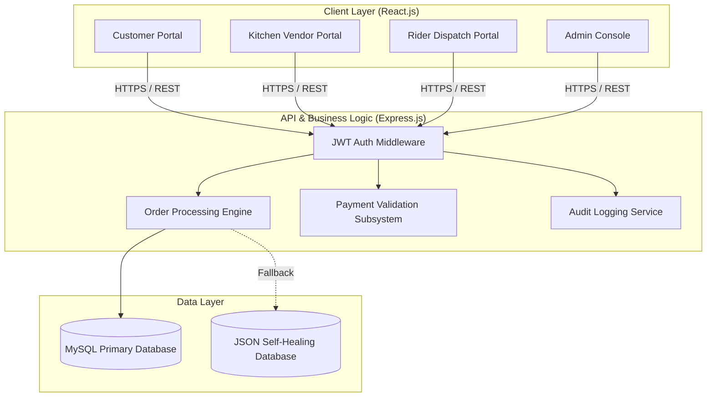

# FUOTUOKE Campus Eats

[](https://github.com/Zoestrings/fuotuoke-campus-eats)
[](LICENSE)
[](https://nodejs.org)
[](https://reactjs.org)
[](https://expressjs.com)
[](https://vercel.com)

**FUOTUOKE Campus Eats** is an enterprise-grade digital dining and food logistics platform designed for the **Federal University Otuoke (FUOTUOKE)** in Bayelsa State, Nigeria. The platform unifies campus food vendors, students, academic/administrative staff, delivery personnel, and system administrators under a secure, role-based architecture.

---

## Table of Contents

- [Executive Summary](#executive-summary)
- [System Architecture](#system-architecture)
- [Role-Based Control Access (RBAC)](#role-based-control-access-rbac)
- [Technology Stack](#technology-stack)
- [Directory Structure](#directory-structure)
- [Environment Configuration](#environment-configuration)
- [API Reference Specification](#api-reference-specification)
- [Database Schema & Models](#database-schema--models)
- [Installation & Local Setup](#installation--local-setup)
- [Payment Gateways & Options](#payment-gateways--options)
- [Security & Compliance](#security--compliance)
- [Production Deployment](#production-deployment)
- [License](#license)

---

## Executive Summary

FUOTUOKE Campus Eats addresses logistics bottlenecks in university dining by digitizing cafeteria operations, automating food dispatch, and providing real-time order tracking.

### Primary Objectives
- **Queue Reduction**: Enables online pre-ordering for counter pickup or faculty building delivery.
- **Multi-Vendor Management**: Aggregates disparate campus cafeteria outlets into a central catalog.
- **Operational Auditing**: Implements administrative logging for all financial transactions and operational parameter changes.
- **High-Availability Data Layer**: Uses MySQL for persistent storage with an automated, zero-config JSON fallback for local offline development.

---

## System Architecture

The application uses a decoupled client-server architecture. The React frontend interacts with the Express REST API via authenticated JWT Bearer HTTP requests.



---

## Role-Based Control Access (RBAC)

The application enforces fine-grained access control across five distinct user roles:

| Role | Access Level | Responsibilities & Capabilities |
| :--- | :--- | :--- |
| **Student** | Customer | Browse menus, place orders, track live status, select pickup or faculty delivery. |
| **Staff** | Customer (Priority) | Access staff-tailored ordering flows, priority support, and campus delivery options. |
| **Kitchen Staff** | Vendor | View active incoming orders for specific outlets, accept orders, update preparation states. |
| **Rider** | Logistics | View assigned delivery queues, access drop-off locations, confirm order delivery. |
| **Administrator** | Global Control | Manage users, configure system parameters (fees, maintenance mode), inspect audit trails. |

---

## Technology Stack

### Frontend Application
- **Framework**: React.js (v18.x)
- **Routing**: React Router v6 (Guarded Route HOCs)
- **State Management**: React Context API (`AuthContext`, `ToastContext`, Custom Controllers)
- **Styling Engine**: Custom CSS System (CSS Variables, Flexbox/Grid, Glassmorphic Panels)
- **Typography & Icons**: *DM Sans*, *Plus Jakarta Sans*, Bootstrap Icons

### Backend Service
- **Runtime**: Node.js (v16+)
- **HTTP Server**: Express.js (v4.x)
- **Authentication**: JWT (JSON Web Tokens), Bcryptjs (10 Hashing Rounds)
- **Security Middleware**: Helmet, CORS, Express Rate Limit

### Database Subsystem
- **Production Storage**: MySQL 8.0+
- **Development Storage**: Embedded JSON SQL Emulator (`backend/config/database.json`)

---

## Directory Structure

```text
fuotuoke-campus-eats/
├── .vscode/                      # Editor & Linter Configurations
│   └── settings.json
├── backend/                      # Node.js + Express API Server
│   ├── config/                   # Database Drivers & SQL Schemas
│   │   ├── database.js
│   │   ├── database.json
│   │   └── schema.sql
│   ├── middleware/               # Auth Guards & Rate Limiters
│   │   └── auth.js
│   ├── models/                   # SQL/JSON Data Access Layer
│   │   ├── AuditLog.js
│   │   ├── MenuItem.js
│   │   ├── Order.js
│   │   ├── Settings.js
│   │   └── User.js
│   ├── routes/                   # REST API Controllers
│   │   ├── audit.js
│   │   ├── auth.js
│   │   ├── menu.js
│   │   ├── orders.js
│   │   ├── payments.js
│   │   └── settings.js
│   ├── seed.js                   # Seeding Script
│   ├── server.js                 # HTTP Server Entrypoint
│   └── package.json
├── frontend/                     # React Client Application
│   ├── public/                   # Static HTML Assets & Media
│   └── src/
│       ├── admin/                # Administrative Portal Views
│       ├── components/           # Core Component Library
│       ├── context/              # Context State Providers
│       ├── customer/             # Customer Ordering Workflows
│       ├── rider/                # Delivery Logistics Views
│       ├── vendor/               # Cafeteria Management Views
│       ├── shared/               # Shared Utilities & Base Elements
│       ├── App.js                # App Routing Configuration
│       ├── index.css             # Global CSS Design Tokens
│       └── index.js              # Application Entrypoint
├── vercel.json                   # Deployment Infrastructure Configuration
├── package.json                  # Workspace Scripts Manifest
└── README.md                     # Technical Documentation
```

---

## Environment Configuration

Create a `.env` file in the `backend/` directory using the parameters defined below:

| Variable Name | Type | Default Value | Description |
| :--- | :--- | :--- | :--- |
| `PORT` | Number | `5000` | HTTP port binding for the Express server. |
| `NODE_ENV` | String | `development` | Environment mode (`development` or `production`). |
| `CLIENT_URL` | String | `http://localhost:3000` | Allowed CORS origin for client requests. |
| `DB_HOST` | String | `localhost` | MySQL hostname endpoint. |
| `DB_PORT` | Number | `3306` | MySQL port binding. |
| `DB_USER` | String | `root` | Database username. |
| `DB_PASSWORD` | String | `""` | Database user password. |
| `DB_NAME` | String | `fuotuoke_campus_eats` | Target SQL schema name. |
| `JWT_SECRET` | String | *Required* | Secret key for signing access tokens. |
| `JWT_EXPIRES_IN` | String | `1d` | Token validity duration. |

---

## API Reference Specification

### Authentication Endpoint Group (`/api/auth`)

#### `POST /api/auth/register`
Creates a new customer account.

**Request Payload:**
```json
{
  "name": "Jane Doe",
  "email": "student@fuotuoke.edu.ng",
  "identifier": "FUO/22/CSI/18843",
  "password": "SecurePassword123#",
  "phone": "+2348000000000"
}
```

**Response (201 Created):**
```json
{
  "success": true,
  "token": "eyJhbGciOiJIUzI1NiIsInR5cCI6...",
  "user": {
    "id": 1,
    "name": "Jane Doe",
    "email": "student@fuotuoke.edu.ng",
    "role": "student"
  }
}
```

#### `POST /api/auth/login`
Authenticates a user and issues a Bearer JWT.

---

### Order Management Endpoint Group (`/api/orders`)

#### `POST /api/orders`
Submits a new order. *(Requires Authorization Header)*

**Request Payload:**
```json
{
  "outletId": "main-cafeteria",
  "items": [
    { "id": 1, "name": "Jollof Rice & Chicken", "price": 1500, "qty": 1 }
  ],
  "total": 1500,
  "deliveryType": "delivery",
  "location": "Faculty of Science, Block B",
  "paymentMethod": "Credit Card"
}
```

---

## Database Schema & Models

```sql
-- Users Table
CREATE TABLE users (
  id INT AUTO_INCREMENT PRIMARY KEY,
  name VARCHAR(255) NOT NULL,
  email VARCHAR(255) UNIQUE NOT NULL,
  identifier VARCHAR(100) NOT NULL,
  password VARCHAR(255) NOT NULL,
  role ENUM('student', 'staff', 'kitchen', 'rider', 'admin') DEFAULT 'student',
  phone VARCHAR(50),
  created_at TIMESTAMP DEFAULT CURRENT_TIMESTAMP
);

-- Orders Table
CREATE TABLE orders (
  id VARCHAR(100) PRIMARY KEY,
  user_id INT NOT NULL,
  outlet_id VARCHAR(50) NOT NULL,
  items JSON NOT NULL,
  total DECIMAL(10, 2) NOT NULL,
  status ENUM('Pending', 'Confirmed', 'Preparing', 'Ready', 'Out for Delivery', 'Delivered', 'Cancelled') DEFAULT 'Pending',
  delivery_type ENUM('pickup', 'delivery') DEFAULT 'pickup',
  location VARCHAR(255),
  payment_method VARCHAR(50) NOT NULL,
  payment_ref VARCHAR(100),
  created_at TIMESTAMP DEFAULT CURRENT_TIMESTAMP
);
```

---

## Installation & Local Setup

### 1. Requirements
- Node.js (v16.0.0 or higher)
- npm (v8.0.0 or higher)
- MySQL Server (v8.0+, optional fallback available)

### 2. Concurrent Startup Procedure

Execute the monorepo dev script to start both services concurrently:

```bash
# Clone the repository
git clone https://github.com/Zoestrings/fuotuoke-campus-eats.git
cd fuotuoke-campus-eats

# Install workspace dependencies
npm install

# Start API and Client concurrently
npm run dev:all
```

- **Frontend Client**: `http://localhost:3000`
- **Backend API**: `http://localhost:5000`

---

## Default Seed Credentials

For evaluation and testing, the seeder provides pre-configured credentials:

| Role | Identifier / User ID | Password | Target Route |
| :--- | :--- | :--- | :--- |
| **System Administrator** | `zoehackz001` | `72364231Zoe@` | `/staff_login` |
| **Kitchen Vendor** | `zoehackz001` | `72364231Zoe@` | `/staff_login` |
| **Delivery Rider** | `zoehackz001` | `72364231Zoe@` | `/staff_login` |
| **Student Customer** | `FUO/22/CSI/18843` | `72364231Zoe@` | `/login` |

---

## Payment Gateways & Options

The application supports three validated payment channels:
1. **Credit / Debit Card**: Online payment workflow simulation with instant validation.
2. **Direct Bank Transfer**: Account details routed to First Bank Nigeria (`Account No: 1234567890`).
3. **Cash on Delivery / Pickup**: Manual payment collection at point of delivery or counter.

---

## Security & Compliance

- **Authentication Guard**: JWT tokens required for restricted REST endpoints.
- **Data Hashing**: Passwords stored using Bcrypt salted hashes (10 rounds).
- **Traffic Control**: Rate limiting enabled via `express-rate-limit`.
- **Audit Compliance**: System mutation events logged with user ID, action, timestamp, and client IP address.

---

## Production Deployment

This repository includes a native `vercel.json` deployment manifest.

### Deployment to Vercel
1. Link your GitHub repository (`Zoestrings/fuotuoke-campus-eats`) to Vercel.
2. Set Build Command: `npm run build`
3. Set Output Directory: `frontend/build`
4. Add environment variables in the Vercel console (`REACT_APP_API_URL`).
5. Trigger build.

---

## License

Distributed under the MIT License. See `LICENSE` for details.

© 2026 Federal University Otuoke (FUOTUOKE) Campus Eats. All rights reserved.
